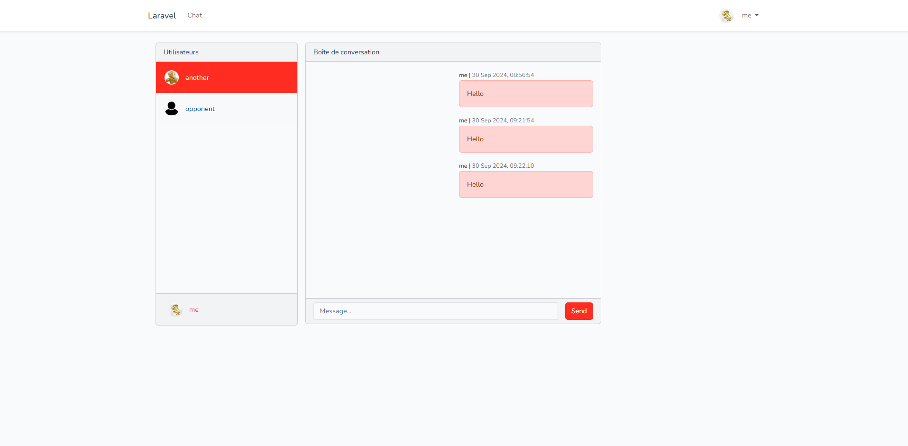

<p align="center"><a href="" target="_blank"></a></p>

# Chatterboxs

## Description du projet

ChatterBocx est une application de messagerie instantanée en temps réel qui utilise les WebSockets pour permettre aux utilisateurs de s'envoyer des messages en direct. L'application dispose de chaînes de discussion basées sur les utilisateurs, ce qui signifie que chaque utilisateur a sa propre chaîne de discussion accessible uniquement par lui-même et les utilisateurs qu'il a ajoutés en tant qu'amis. L'application a été développée avec Laravel et React.




### Prérequis :

[**PHP**](https://www.php.net/downloads.php)

[**Composer**](https://getcomposer.org/download/)

[**Node**](https://nodejs.org/fr/download/package-manager)

[**MySQL**](https://www.mysql.com/fr/products/community/)


### Installation :  

**Étape 1** : cloner le repository

```shell
git clone https://github.com/TanvirUd/ChatterBocx.git
cd ChatterBocx
```

**Étape 2** : Cree un fichier ".env" a l'aide du fichier  ".env.example".

**Étape 3** : Créez un cluster vide dans votre base de données et remplissez le champ DB_DATABASE avec le nom du cluster (par exemple, nous avons choisi "test" comme nom de base de données).

```.env
DB_CONNECTION=mysql
DB_HOST=127.0.0.1
DB_PORT=3306
DB_DATABASE=test
DB_USERNAME=root
DB_PASSWORD=
```

**Étape 4** : Installer les dépendances PHP

```shell
composer install
```

**Étape 5** : Installer les dépendances

```shell
npm install
```

**Étape 6** : generer une cle d'application

```shell
php artisan key:generate
```

**Étape 7** : faire une refresh de la migration pour appliquer toutes les données dans la base de données.

```shell
php artisan migrate:fresh
```

**Étape 8** : executer la commande php artisan optimize pour actualiser le code et les roots

```shell
php artisan optimize
```

**Étape 9** :  executer toutes les instance pour lancer l'application (ces instances se déroulent en continu)

*sauf celui-ci*
```shell
npm run build
```

```shell
php artisan queue:listen
```

```shell
php artisan reverb:start
```

et pour finir le lancement du server

```shell
php artisan serve
```

Et si toutes les étapes ont été fait dans l'ordre l'application devrait marcher.

## Credits

- TanvirUd
- LazMan8
